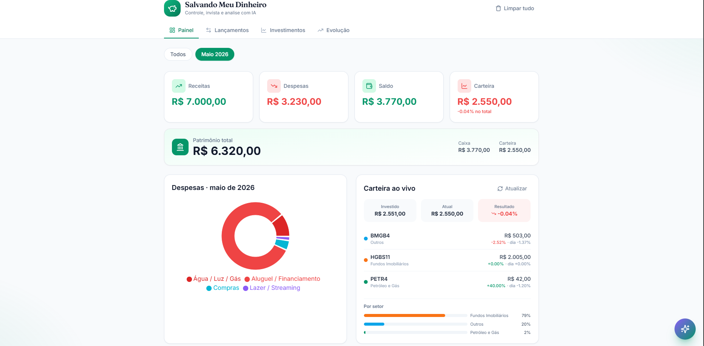
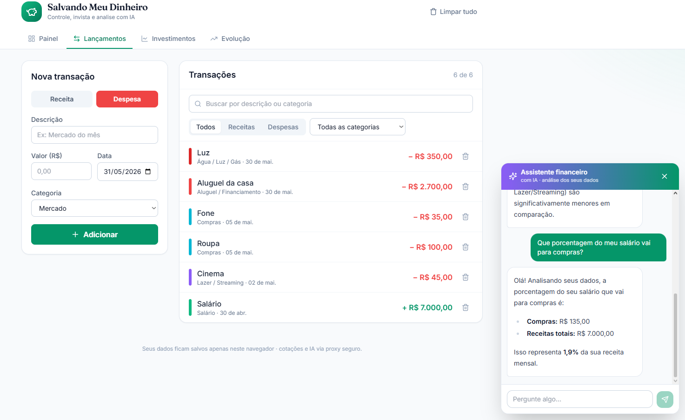
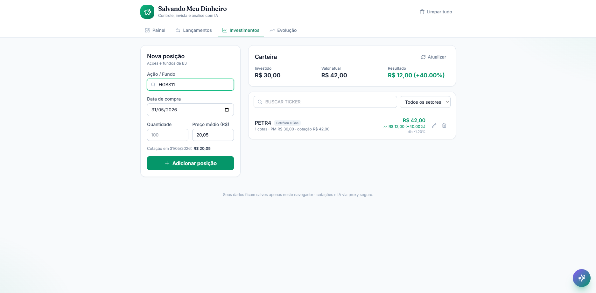

# Salvando Meu Dinheiro

**Demo:** https://salvando-meu-dinheiro.vercel.app

App web de finanças pessoais. Registre receitas e despesas, monte uma carteira de ações da B3 com cotação em tempo real e peça uma análise da IA com sugestões de corte de gastos, leitura da saúde financeira e alertas de volatilidade.

Tudo do usuário fica no `localStorage` do navegador — sem conta, sem login, sem backend de dados. As chaves de API ficam escondidas atrás de um Cloudflare Worker e nunca chegam ao navegador.



## Funcionalidades

Quatro abas, mais um chat:

- **Painel** — saldo, total de receitas e despesas, gráfico de despesas por categoria e a lista de lançamentos.
- **Lançamentos** — adicione receitas e despesas (descrição, valor, categoria, data) e remova o que quiser. Categorias agrupadas por tipo no select.
- **Investimentos** — cadastro de ações da B3 por ticker, quantidade e preço médio. Busca de tickers enquanto digita, cotação em tempo real (atualiza a cada 60s), preço atual, variação do dia, valor da carteira, lucro/prejuízo e alocação por setor.
- **Análise IA** — relatório em português a partir dos seus números: onde está gastando mais, como anda o saldo, sugestões e avisos de volatilidade dos ativos.
- **Chat** — tira dúvidas sobre as finanças usando o mesmo contexto da análise.

Dinheiro é formatado em real e percentuais com helper próprio. Texto e categorias em português.

## Telas

Lançamentos com o assistente de IA respondendo sobre os gastos:



Carteira de investimentos com cotação ao vivo:



## Stack

- Vite + React 19
- Tailwind CSS v3 (+ plugin `typography`)
- Recharts — gráficos de pizza e de evolução
- Lucide React (ícones) e react-markdown (relatório da IA)
- Cloudflare Worker — proxy do Google Gemini (análise) e da brapi.dev (cotações da B3)

## Arquitetura

```
Navegador (Vite/React)  ──►  Cloudflare Worker  ──►  Gemini API   (POST /analyze)
   localStorage                 (chaves aqui)    └─►  brapi.dev    (GET /quote, /history, /search)
```

Todo o estado financeiro passa por um único contexto React (`FinanceContext`), que guarda transações e investimentos, deriva os totais e persiste cada fatia no `localStorage`. As cotações ficam de fora do contexto: são buscadas sob demanda e nunca salvas. O front só conhece a URL do Worker — toda chamada externa passa por ele.

## Segurança

- **Chaves fora do navegador.** A chave do Gemini e o token da brapi ficam como secrets do Cloudflare Worker. O front nunca as vê, então elas não aparecem no código nem nas requisições de rede — o navegador só fala com o Worker.
- **Rate limit por IP.** O Worker limita as rotas externas por `CF-Connecting-IP`, header definido pelo Cloudflare e que o cliente não consegue forjar. Segura o backend mesmo se o cooldown do front for burlado.
- **CORS restrito à origem do site** em produção.
- **Teto de gastos** configurado no provedor — um eventual abuso esbarra na cota e não vira custo.
- **Nenhum dado do usuário sai do navegador.** Não há banco nem conta: os lançamentos vivem só no `localStorage`. O Worker apenas repassa números agregados para a IA na hora de analisar.

## Rodando localmente

```bash
npm install
cp .env.example .env.local   # preencha VITE_WORKER_URL
npm run dev                  # http://localhost:5173
```

O front conversa com o Worker (pasta `worker/`), que precisa das suas próprias chaves do Gemini e da brapi configuradas como secrets. Com o Worker no ar, aponte `VITE_WORKER_URL` para ele.

> A análise é gerada por IA e não constitui recomendação de investimento.
